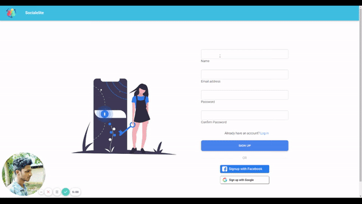

# Socialelite(Login and registration with MERN stack)

</br>
Minimal full-stack MERN app with authentication using express and JWTs.</br>
Live Demo: https://tender-poincare-56ebfe.netlify.app/


This project uses the following technologies:

- [React](https://reactjs.org) and [React Router](https://reacttraining.com/react-router/) for frontend
- [Express](http://expressjs.com/) and [Node](https://nodejs.org/en/) for the backend
- [MongoDB](https://www.mongodb.com/) for the database


## Quick Start

```javascript
// Install dependencies for server & client
npm install && npm run client-install

// Run client & server with concurrently
npm run dev

// Server runs on http://localhost:5000 and client on http://localhost:3000
```

For deploying to Heroku, please refer to [this](https://www.youtube.com/watch?v=71wSzpLyW9k) helpful video by TraversyMedia.


## Contributing
Questions, comments, suggestions, and other contributions are welcome, as this is an open-source example project and not officially maintained as part of an application or library etc. 


